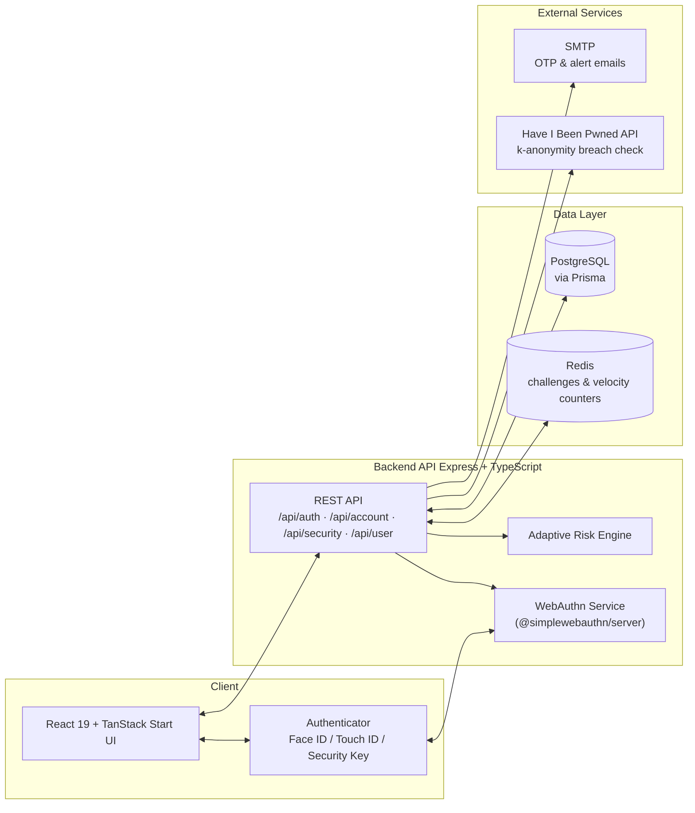

<p align="center">
  
</p>

<h1 align="center">NovaBank</h1>
<p align="center"><strong>Passwordless banking, end to end  no passwords, anywhere, ever.</strong></p>

<p align="center">
  <a href="#">Live Demo</a> ·
  <a href="#">Video Walkthrough</a> ·
  <a href="#">Presentation Deck</a>
</p>
<p align="center"><sub><em>(Links above are placeholders  add before submission/publishing.)</em></sub></p>

<p align="center">
  
  
  
  
  
  
  
  
  
  
  
</p>

> **Demo project.** NovaBank showcases passwordless auth patterns end to end. It is not audited or hardened for real financial data  don't use it to hold real money or real user credentials.

**nopass** is a full-stack demo of a passwordless digital bank. Sign-up and sign-in run entirely on [WebAuthn](https://webauthn.io/) passkeys (Face ID / Touch ID / security keys)  backed by a real adaptive risk engine, step-up verification, keystroke-dynamics behavioral biometrics, and cross-device QR login.

It's a monorepo with two apps:

| App | Description |
|---|---|
| **`frontend/`** | React 19 + TanStack Start banking UI  marketing pages, signup, dashboard, transfers, security center |
| **`backend/`** | Express + PostgreSQL + Redis API  WebAuthn, risk scoring, sessions, transactions |

---

## Table of Contents

- [Why NovaBank?](#why-novabank)
- [Features](#features)
- [Screenshots](#screenshots)
- [Architecture](#architecture)
- [Tech Stack](#tech-stack)
- [Project Structure](#project-structure)
- [Getting Started](#getting-started)
- [Environment Variables](#environment-variables)
- [API Reference](#api-reference)
- [Frontend Routes](#frontend-routes)
- [Risk Engine](#risk-engine)
- [Scripts](#scripts)
- [Roadmap](#roadmap)
- [Team](#team)
- [Acknowledgements](#acknowledgements)
- [License](#license)

---

## Why NovaBank?

Passwords are the weakest link in consumer banking  reused across sites, phished, leaked in breaches, and expensive to reset. Passkeys close that gap with public-key cryptography bound to a device and biometric, making the most common attack vectors (phishing, credential stuffing, password reuse) structurally impossible.

NovaBank exists to show that a passwordless flow can be *complete*, not just a login screen bolted onto a demo:

- **No fallback password, anywhere**  registration, sign-in, and recovery are all passkey-native.
- **Risk-aware, not just pass/fail**  every sign-in is scored, and the outcome (allow, step up, block) adapts to context instead of being a single binary check.
- **Cross-device by design**  QR-based approval mirrors how real passkey ecosystems handle a new device without a shared secret.
- **A real banking surface**  transfers, transaction history, and a security center sit on top of the auth layer, so the auth story is tested against realistic user flows, not just a login form.

## Features

**Authentication**
- Passkey registration & sign-in via WebAuthn (`@simplewebauthn`)
- Cross-device sign-in: scan a QR code on a new device, approve from an already-signed-in device
- Recovery codes as a passkey-loss fallback
- Have I Been Pwned k-anonymity check on the email used at signup

**Adaptive risk engine**
- Six weighted signals per sign-in: new device, new IP, country change, keystroke-dynamics anomaly, login velocity, unusual hour
- Score maps to an outcome: allow, step up (email OTP or second passkey), or block
- Blocked attempts trigger an alert email; every attempt lands in a login-history log with the signals that fired

**Banking**
- Account summary and transaction history
- Money transfers with step-up confirmation
- Security center: manage passkeys, trusted devices, and active sessions (revoke individually or all); manage recovery codes

## Screenshots

> *Placeholders  replace with actual screenshots or GIFs before publishing.*

| Dashboard | Passkey Login |
|---|---|
|  |  |

| Security Center | Cross-Device QR Login |
|---|---|
|  |  |

## Architecture



## Tech Stack

**Frontend** (`frontend/`)
- [TanStack Start](https://tanstack.com/start) (file-based routing) + TanStack Router + TanStack Query
- React 19, Tailwind CSS 4
- shadcn/ui-style components (Radix primitives) + lucide-react icons
- `@simplewebauthn/browser` for passkey ceremonies, `qrcode.react` for the QR login screen
- Package manager: [Bun](https://bun.sh)

**Backend** (`backend/`)
- Express + TypeScript
- PostgreSQL via Prisma ORM
- Redis (WebAuthn challenge storage, login-velocity counters)
- `@simplewebauthn/server` for passkey verification, `jsonwebtoken` for access/refresh tokens, `argon2` for recovery-code hashing
- `helmet`, `hpp`, `express-rate-limit` for baseline API hardening

## Project Structure

```
nopass/
├── backend/
│   ├── prisma/
│   │   ├── schema.prisma      # User, Credential, Session, Transaction, RiskLog, etc.
│   │   └── migrations/
│   └── src/
│       ├── config/            # env, db, redis
│       ├── controllers/       # auth, account, security, user
│       ├── routes/            # /api/auth, /api/account, /api/security, /api/user
│       ├── services/          # webauthn, riskEngine, keystroke, qr, device, email, hibp
│       ├── middleware/        # auth guard, rate limiters, error handler
│       └── utils/             # crypto, geo, validators, logger
└── frontend/
    └── src/
        ├── routes/            # file-based pages (see below)
        ├── components/
        │   ├── nova/          # NovaBank-specific UI
        │   └── ui/            # shadcn/ui base components
        └── lib/                # API client, session store
```

## Getting Started

### Prerequisites

- Node.js
- [Bun](https://bun.sh) (frontend package manager  the project ships a `bun.lock`)
- PostgreSQL 15+
- Redis

### 1. Backend

```sh
cd backend
npm install
cp .env.example .env   # then fill in the values, see table below
npm run db:generate    # generate the Prisma client
npm run db:migrate     # run migrations against your database
npm run dev            # starts the API on http://localhost:3001
```

### 2. Frontend

```sh
cd frontend
bun install
bun run dev             # starts the UI, URL is printed by Vite
```

Point the frontend at your API by setting `VITE_API_BASE_URL` if it isn't already wired to `http://localhost:3001`.

## Environment Variables

`backend/.env`

| Variable | Default | Notes |
|---|---|---|
| `DATABASE_URL` |  | PostgreSQL connection string |
| `REDIS_URL` | `redis://localhost:6379` | Used for WebAuthn challenges and login-velocity tracking |
| `PORT` | `3001` | API port |
| `JWT_SECRET` |  | ≥16 chars, signs access tokens |
| `JWT_REFRESH_SECRET` |  | ≥16 chars, signs refresh tokens |
| `WEBAUTHN_RP_NAME` | `NovaBank` | Relying party display name |
| `WEBAUTHN_RP_ID` | `localhost` | Relying party ID  must match the domain passkeys are bound to |
| `WEBAUTHN_ORIGIN` | `http://localhost:5173` | Must match the origin the frontend is actually served from |
| `EMAIL_HOST` / `EMAIL_PORT` / `EMAIL_USER` / `EMAIL_PASS` | `smtp.resend.com` / `587` / `resend` /  | SMTP for OTP + alert emails. Set `EMAIL_PASS` to a [Resend](https://resend.com) API key; the From address must be on your verified sending domain (`updates.sciencegear.tech`). Leave blank in dev to log codes to the console |
| `HIBP_API_KEY` |  | Optional; the breach check itself uses the free k-anonymity range API and works without a key |
| `NODE_ENV` | `development` | In dev, step-up OTP codes are echoed in the API response for convenience |

## API Reference

All routes are prefixed with `/api`. Routes marked 🔒 require a `Bearer` access token.

**`/auth`**

| Method | Path | Purpose |
|---|---|---|
| POST | `/register/options` / `/register/verify` | Passkey registration ceremony |
| POST | `/login/options` / `/login/verify` | Passkey sign-in ceremony (may return `stepUpRequired`) |
| POST | `/login/qr/create` | Start a cross-device QR session |
| GET | `/login/qr/status/:token` | Poll QR session status |
| POST | `/login/qr/approve` 🔒 | Approve a QR session from an authenticated device |
| POST | `/login/qr/exchange` | Exchange an approved QR grant for tokens |
| POST | `/step-up/verify` | Complete step-up via email OTP, recovery code, or passkey |
| POST | `/refresh` | Rotate an access/refresh token pair |
| POST | `/logout` | Revoke a refresh token |
| GET | `/me` 🔒 | Current user |

**`/account`** 🔒

| Method | Path | Purpose |
|---|---|---|
| GET | `/summary` | Account balance summary |
| GET | `/transactions` | Transaction history |
| POST | `/transfer` | Create a transfer (rate-limited) |
| POST | `/transfer/confirm` | Confirm a transfer |

**`/security`** 🔒

| Method | Path | Purpose |
|---|---|---|
| GET | `/activity` | Login & security event history |
| GET | `/passkeys` / POST `/passkeys/register/options` + `/verify` / DELETE `/passkeys/:id` | Manage passkeys |
| GET | `/recovery-codes` / POST `/recovery-codes/rotate` | Recovery codes |
| GET | `/devices` / DELETE `/devices/:id` | Trusted devices |
| POST | `/sessions/:id/revoke` / `/sessions/revoke-all` | Session management |

**`/user`** 🔒

| Method | Path | Purpose |
|---|---|---|
| GET / PATCH | `/profile` | Read or update profile |

## Frontend Routes

| Path | Page |
|---|---|
| `/` | Marketing home |
| `/about`, `/pricing` | Marketing pages |
| `/signup` | Passkey registration flow |
| `/login` | Passkey sign-in (supports `?risk=low\|medium\|high` to demo risk states) |
| `/login/approve` | Cross-device QR approval |
| `/dashboard` | Account summary, transactions, security snapshot |
| `/accounts` | Account details |
| `/transfer` | Send money with step-up verification |
| `/activity` | Login & security history |
| `/security`, `/settings/security` | Passkeys, recovery codes, trusted devices |

## Risk Engine

Each sign-in accumulates a score from independent signals, then maps to an action:

| Score | Action |
|---|---|
| ≤ 30 | Allow |
| 31–60 | Step up with an email OTP |
| 61–100 | Step up with a second passkey prompt |
| > 100 | Block, and email an alert |

**Signals:** new device (+30), new IP (+20), country change (+20), keystroke-pattern anomaly (+20), unusual login velocity (+15), login outside usual hours (+10).

## Scripts

**Backend**

| Command | Description |
|---|---|
| `npm run dev` | Start the API with hot reload |
| `npm run build` / `npm start` | Build and run the compiled API |
| `npm run db:generate` | Generate the Prisma client |
| `npm run db:migrate` | Run database migrations |
| `npm run lint` | Lint with ESLint |

**Frontend**

| Command | Description |
|---|---|
| `bun run dev` | Start the dev server |
| `bun run build` | Production build |
| `bun run preview` | Preview the production build |
| `bun run lint` | Lint with ESLint |
| `bun run format` | Format with Prettier |

## Deployment

NovaBank runs the API on [Render](https://render.com) and the web app on [Vercel](https://vercel.com). Passkeys are bound to the exact origin, so the `WEBAUTHN_*` values below must match your real domain.

### 1. Backend → Render

The repo ships a `render.yaml` blueprint. In the Render dashboard: **New + → Blueprint → select this repo**. It builds `backend/`, runs `npm run db:deploy` (Prisma migrations) before each deploy, and serves `node dist/index.js` on port 3001.

Set these as **secret** env vars in the Render dashboard (the blueprint marks them `sync: false`):

| Variable | Value |
|---|---|
| `DATABASE_URL` | your PostgreSQL URL (Aiven, Render Postgres, etc.) |
| `REDIS_URL` | a real Redis URL (e.g. [Upstash](https://upstash.com) free tier, `rediss://...`)  `memory://` is dev-only |
| `JWT_SECRET` / `JWT_REFRESH_SECRET` | long, unique, random strings |
| `EMAIL_PASS` | your Resend API key |
| `TEXTBEE_API_KEY` | your TextBee API key |

The blueprint already sets `WEBAUTHN_RP_ID=novabank.sciencegear.tech`, `WEBAUTHN_ORIGIN` and `CORS_ORIGINS` to both apex and `www`, and the SMTP/TextBee/Admin values. Adjust if your domain differs.

Note the API binds to port 3001 locally, but Render injects `PORT` itself; the server uses `env.PORT` and respects it.

### 2. Frontend → Vercel

The frontend builds with the Nitro **vercel** preset (`nitro: { preset: "vercel" }` in `vite.config.ts`), producing `.vercel/output` (Build Output API v3). `frontend/vercel.json` sets the build/install commands and output directory. In Vercel:

- Import the repo with **Root Directory = `frontend`**.
- Add an **Environment Variable** `VITE_API_BASE_URL` = `https://<your-render-service>.onrender.com/api` (the full API URL including `/api`). Without it, the app falls back to `/api`, which only exists via the Vite dev proxy.
- Attach the custom domain `novabank.sciencegear.tech` (and `www.`) to the Vercel project, and point DNS at Vercel (e.g. CNAME `cname.vercel-dns.com`).

### 3. Post-deploy checks

- `GET https://<render>.onrender.com/api/health` → `{"status":"ok","database":"ok","redis":"ok"}`.
- Sign in with a passkey at `https://novabank.sciencegear.tech`  the WebAuthn ceremony only succeeds if the RP origin matches the exact domain you registered it on.
- Phone OTP (TextBee) and email (Resend) must be configured before they can be exercised from production.

## Roadmap

Realistic next steps beyond the hackathon scope:

- [ ] Automated test suite (unit + integration) and CI pipeline
- [ ] Dockerized local dev setup (`docker-compose` for Postgres + Redis + both apps)
- [ ] WebAuthn conditional UI (passkey autofill) on the login form
- [ ] Real-time transaction/security notifications (WebSockets or SSE)
- [ ] Admin/risk-analyst view for reviewing flagged sign-in attempts
- [ ] Native mobile client (React Native) using platform passkeys
- [ ] Multi-currency account support
- [ ] Accessibility pass (WCAG 2.1 AA audit)
- [ ] Formal license selection

## Team

> *Placeholders  replace with actual team member details.*

| Name | Role | Links |
|---|---|---|
| *Your Name* | *Full-stack, WebAuthn & risk engine* | *[GitHub](#) · [LinkedIn](#)* |
| *Teammate Name* | *Frontend* | *[GitHub](#) · [LinkedIn](#)* |
| *Teammate Name* | *Backend & infrastructure* | *[GitHub](#) · [LinkedIn](#)* |

## Acknowledgements

- [WebAuthn.io](https://webauthn.io/) and the FIDO Alliance for passkey standards and reference material
- [`@simplewebauthn`](https://simplewebauthn.dev/) for the WebAuthn registration/authentication ceremony implementation
- [Have I Been Pwned](https://haveibeenpwned.com/) for the k-anonymity breach-check API
- [shadcn/ui](https://ui.shadcn.com/) and [Radix UI](https://www.radix-ui.com/) for accessible component primitives
- [TanStack](https://tanstack.com/) (Start, Router, Query) for the frontend framework
- *(Hackathon name / organizers  placeholder)*

## License

No license file is currently included in this repository  all rights reserved by default unless the maintainer adds one.
